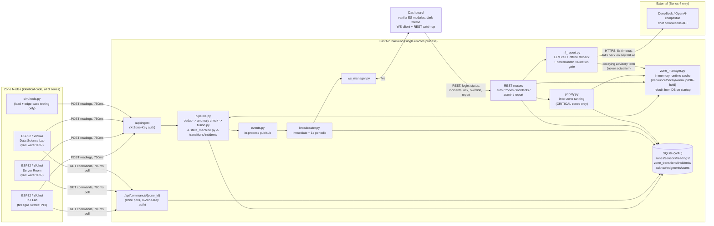
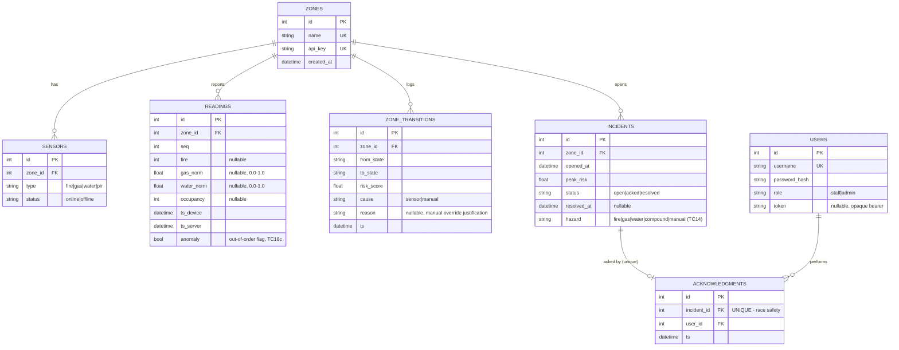

# SCS-RG — Documentation

Multi-Hazard Smart Campus Safety & Response Grid. RoboFusion 1.0 Techathon,
Round 1. Team: `Error404`. Track B (Wokwi ESP32) primary — see
[Track declaration](#17-track-declaration).

This file is the source for the submitted PDF (export via any Markdown→PDF
tool, e.g. Pandoc or VS Code's "Markdown PDF" extension, after inserting the
Wokwi screenshots noted in [Circuit Diagrams](#13-circuit-diagrams-per-zone)).

---

## 1. System Overview

Three campus zones (IoT Lab, Server Room, Data Science Lab) each run an
identical ESP32 node that reads raw hazard sensors and posts them to a
central FastAPI backend every 750 ms. The backend — never the node — fuses
those readings into a risk score, classifies SAFE/WARNING/CRITICAL,
persists every state transition and incident, and is the only thing that
ever tells a node to sound its buzzer/relay. A single-page dashboard
subscribes over WebSocket and renders exactly what the backend/DB say,
never deriving state on its own.

## 2. Architecture



Key properties this diagram is meant to make visible:

- **Single source of truth (rule 2)**: every REST response and every WS push
  for zone/priority state is built by exactly one function,
  `status_service.build_zone_status_payload()`. The dashboard never derives
  state client-side.
- **Actuation is one-directional and sensor-only (rule 4)**: `Commands`
  reads only `zone_transitions` (which only `pipeline.py`'s sensor/override
  path writes). `nl_report.py` and the Bonus-3 prediction path (if built)
  have no code path into `Commands` or `zone_transitions` at all — not "we
  choose not to call it," there is no import edge.
- **Restart safety (rule 6)**: `zone_manager.py`'s in-memory cache is
  rebuilt from `zone_transitions`/`readings` in `main.py`'s lifespan
  startup, before the app accepts any connection.

## 3. Risk Fusion Formula (locked)

```
risk_score(zone) =
    40 * fire_signal        (0–1 continuous, debounced entry / decaying exit)
  + 25 * gas_level_norm     (0.0–1.0, MQ-2 normalized; 0 during 30s warm-up)
  + 25 * water_level_norm   (0.0–1.0)
  + 10 * occupancy_factor   (0 or 1, PIR after a 1.5s hold)

SAFE < 30   |   30 <= WARNING < 65   |   CRITICAL >= 65
Hysteresis: exit CRITICAL only below 55, with a minimum 3s hold.
```

Implemented verbatim in `backend/fusion.py` (the score) and
`backend/state_machine.py` (the band + hysteresis) — weights are named
constants in `backend/config.py` (`WEIGHT_FIRE=40`, `WEIGHT_GAS=25`,
`WEIGHT_WATER=25`, `WEIGHT_OCCUPANCY=10`), not re-derived or duplicated
anywhere else, so the numbers in this document and the numbers the backend
actually computes with cannot drift apart (TC30).

**Justification.** Fire is weighted highest because it is the
fastest-escalating and most destructive hazard in electronics-dense labs —
a debounced flame reading alone (40) sits just below WARNING, but combined
with almost any secondary hazard reading it crosses into CRITICAL within
one reading cycle. Water is raised to parity with gas (both 25) because two
of our three zones are server/GPU rooms, where a coolant or condensate leak
is the realistic catastrophic failure mode, not a hypothetical one — a
flood-equivalent hazard deserves the same weight as a gas leak, not a
token afterthought — and, unlike fire (40) alone, a debounced flame
reading by itself already crosses into WARNING; either gas or water raised
to parity means a second hazard reliably tips a WARNING zone into
CRITICAL within one reading cycle, rather than requiring a third signal.
Occupancy is weighted lowest (10) *in a zone's own score*, deliberately:
an empty zone on fire is still a full equipment/infrastructure emergency
regardless of who's in the room, so occupancy shouldn't be able to
suppress a hazard score. Its real weight belongs in
**cross-zone triage** — deciding which of several simultaneously-CRITICAL
zones responders reach first — where life safety should dominate. That's
why occupancy reappears, much more heavily, in the priority formula below
(life > assets) instead of being duplicated in the per-zone score.

**Sensor pipeline parameters** (all named constants in `backend/config.py`,
enforced in `backend/zone_manager.py`):

| Parameter | Value | Effect |
|---|---|---|
| Sampling interval | 750 ms | Node POST cadence |
| Flame debounce | 5 consecutive HIGH readings | Brief flicker never triggers |
| Flame decay | linear to 0 over 5 s | No instant snap on removal |
| Gas warm-up | ignored for 30 s after boot (`uptime_ms`) | No false trigger on cold start |
| PIR hold | 1.5 s before a state change is applied/logged | No log/score spam on flicker |
| Offline threshold | no reading for > 3 s (4× interval) | Distinct OFFLINE badge, never SAFE |

## 4. State Machine

`backend/state_machine.py::classify()` — pure function, no I/O, unit-tested
directly. CRITICAL is sticky: once entered, the zone cannot exit until both
conditions hold simultaneously — score has dropped below 55 (not 65, to
avoid immediate flip-flop right at the boundary) **and** at least 3 s have
elapsed since CRITICAL was entered. SAFE and WARNING have no hysteresis;
they reclassify on every reading purely from the current score.

## 5. Priority Ranking (locked, cross-zone triage)

```
priority = risk_score
         + 15 * occupancy_factor              (people present -> jump the queue)
         + min(10, unacked_seconds / 15)      (escalates while ignored, cap +10)
         + advisory_boost (Bonus 4, cap +10, decays over 10 min)
Tie-break: earlier CRITICAL entry first.
```

Computed only over zones **currently CRITICAL** (`backend/priority.py`).
Occupancy dominates here rather than in the per-zone score because this is
exactly the "which fire do we run to first" decision, where life safety
should outweigh raw hazard magnitude. The `occupancy_factor` used *here*
is PIR backed up by the Bonus 1 camera cross-check (`PIR OR fresh camera
detection` — see [§11](#11-bonus-1--camera-based-occupancy-check)); the
zone's own risk score stays PIR-only per the locked formula.
`unacked_seconds` escalates a zone's priority the longer it sits
un-acknowledged, capped at +10 so an old, low-risk incident can never
permanently outrank a fresh, severe one. `advisory_boost` (Bonus 4) is the
only non-sensor-derived term in the system, and it is deliberately
confined to *this* formula — see
[§10 NL Incident Reporting](#10-bonus-4--nl-incident-reporting).

The dashboard renders the exact breakdown per zone, e.g.:

```
Risk 78 + Occupied +15 + unacked 90s +6 = 99
```

so a judge can verify the ranking without trusting a black box (TC12c).

## 6. Database Schema

SQLite via SQLAlchemy, WAL journal mode, `PRAGMA foreign_keys=ON` (see
`backend/database.py`). All foreign keys are `ON DELETE RESTRICT` — a zone
with any historical row (a sensor, a reading, a transition, an incident)
cannot be deleted, only left in place (TC18b).



**Indexes**: `idx_incidents_status_created(status, opened_at)` — the
`GET /api/incidents?status=&from=&to=` filter path (TC19); verified to stay
fast (~14 ms) against 300+ seeded incidents / 10k+ seeded readings via
`sim/seed.py --readings 10000 --incidents 300`. `idx_readings_zone_ts
(zone_id, ts_server)` — per-zone chronological reads (trend window,
timeline queries).

**Three additive columns beyond the literal locked schema block** (each
required by a scored *behavioral* requirement that has nowhere else to live
— logged in full in `ASSUMPTIONS.md`):

- `readings.anomaly` — a reading whose `ts_device` is earlier than the
  zone's last-applied reading is stored (audit trail) and flagged, but
  never rewrites current state (TC18c).
- `zone_transitions.reason` — carries the admin's free-text justification
  required by "manual state set **with reason**" (`POST /api/admin/override`).
- `incidents.hazard` — TC14 requires the incident log to show and filter by
  *hazard type*. Set once at incident open from the fusion contributions at
  that instant: every hazard contributing ≥ 10 points, largest first
  (`"fire"`, `"fire+water"`, …), or `"manual"` for an admin-override-opened
  incident, so the log also shows *what kind* of event each incident was,
  not just that one happened.

**Race safety**: `acknowledgments.incident_id` is `UNIQUE`. Ack is
implemented as an insert that relies on the DB constraint, not an
application-level check-then-write — see `backend/ack_service.py`. Two
concurrent ack requests for the same incident: exactly one succeeds (200),
the other gets 409, enforced by SQLite itself (TC7b).

## 7. API Reference

Base URL: `http://<host>:8000`. Auth is either a zone API key
(`X-Zone-Key` header, issued per zone by `scripts/init_db.py`) or a bearer
user token (`Authorization: Bearer <token>`, issued by `/api/auth/login`).

| Method | Path | Auth | Purpose |
|---|---|---|---|
| POST | `/api/ingest` | `X-Zone-Key` | Raw sensor readings in; validated, deduped by `(zone_id, seq)` |
| GET | `/api/zones/status` | bearer | All zones' current state + priority queue in one call |
| GET | `/api/zones/{id}/trend` | bearer | Bonus 2 — slope/rising flag for one zone |
| GET | `/api/incidents?from=&to=&zone=&status=&hazard=` | bearer | History, filterable (incl. hazard type, TC14) |
| GET | `/api/incidents/{id}` | bearer | Full transition timeline for one incident (TC14) |
| POST | `/api/incidents/{id}/ack` | staff/admin | Exactly-once acknowledgment |
| POST | `/api/admin/override` | admin only | Manual state set with reason, `cause='manual'` |
| GET | `/api/admin/health` | admin only | System health |
| POST | `/api/auth/login` | — | Returns bearer token + role |
| GET | `/api/commands/{zone_id}` | `X-Zone-Key` | Zone node polls actuation commands |
| WS | `/ws?token=` | bearer (query param) | Pushes `snapshot` / `state_change` / `incident_ack` / `periodic_snapshot` |
| POST | `/api/report` | staff/admin | Bonus 4 — NL incident reporting |
| POST | `/api/camera` | `X-Zone-Key` | Bonus 1 — camera occupancy check-in |
| GET | `/api/ping` | — | Liveness check |

### POST `/api/ingest`

```json
// Request
{
  "seq": 42,
  "fire": 0,
  "gas_norm": 0.35,
  "water_norm": 0.10,
  "occupancy": 1,
  "ts_device": "2026-07-25T09:00:00Z",
  "uptime_ms": 65000
}
// 200 Response
{ "duplicate": false, "anomaly": false, "state": "WARNING", "risk_score": 27.5 }
```
`gas_norm`/`water_norm` outside `[0.0, 1.0]`, `fire`/`occupancy` not 0/1 →
`422` with a field-level error body (TC6b, TC23f). Unregistered
`X-Zone-Key` → `401` (TC10a). A field that is `null`/omitted marks that
sensor offline for the reading, contributing 0 to the score — never
fabricated as SAFE.

### GET `/api/zones/status`

```json
// 200 Response (abridged to one zone)
{
  "zones": [
    {
      "zone_id": 2, "name": "Server Room", "state": "CRITICAL",
      "risk_score": 65.0, "offline": false,
      "sensors": [
        {"type": "fire", "status": "online", "value": 1},
        {"type": "water", "status": "online", "value": 1.0},
        {"type": "pir", "status": "online", "value": 1}
      ],
      "last_reading_at": "2026-07-25T09:00:03Z",
      "open_incident_id": 7, "incident_status": "open",
      "trend": {"scores": [25.0, 25.0, 25.0, 65.0], "slope": 10.0, "rising": false},
      "predicted_risk": {"p_critical": 0.87, "likely": true,
                          "model": "logistic_regression", "horizon_seconds": 120},
      "camera": {"occupied": true, "confidence": 0.9, "fresh": true,
                  "agrees_with_pir": true}
    }
  ],
  "priority_queue": [
    {"zone_id": 2, "zone_name": "Server Room", "risk_score": 65.0,
     "occupied": true, "unacked_seconds": 26.0, "priority": 82.0,
     "justification": "Risk 65 + Occupied +15 + unacked 26s +2 = 82"}
  ],
  "server_time": "2026-07-25T09:00:04Z"
}
```
No token → `401` (TC10b).

### GET `/api/zones/{id}/trend`
```json
{ "zone_id": 1, "scores": [10, 15, 22, 30, 41], "slope": 7.8, "rising": true }
```

### GET `/api/incidents?zone=2&status=open&hazard=water`
```json
[
  {
    "id": 7, "zone_id": 2, "zone_name": "Server Room",
    "opened_at": "2026-07-25T09:00:00Z", "peak_risk": 72.5,
    "status": "open", "resolved_at": null,
    "hazard": "fire+water", "ack": null
  }
]
```
`hazard=water` matches both `"water"` and compound labels like
`"fire+water"`; `hazard=manual` isolates override-opened incidents.

### GET `/api/incidents/{id}`
```json
{
  "incident": { "...": "IncidentOut, as above" },
  "transitions": [
    {"id": 40, "from_state": "SAFE", "to_state": "WARNING", "risk_score": 42.0,
     "cause": "sensor", "reason": null, "ts": "2026-07-25T08:59:57Z"},
    {"id": 41, "from_state": "WARNING", "to_state": "CRITICAL", "risk_score": 72.5,
     "cause": "sensor", "reason": null, "ts": "2026-07-25T09:00:00Z"}
  ]
}
```
Unknown id → `404`.

### POST `/api/incidents/{id}/ack`
```json
// 200 Response
{ "incident_id": 7, "acked_by": 3, "ts": "2026-07-25T09:00:10Z" }
```
Unknown id → `404`. Already acked (loser of a concurrent race, or a second
click) → `409` (TC7b).

### POST `/api/admin/override`
```json
// Request
{ "zone_id": 2, "target_state": "CRITICAL", "reason": "fire drill" }
// 200 Response
{ "zone_id": 2, "state": "CRITICAL", "transitioned": true }
```
Non-admin bearer token → `403`, enforced inside the handler via
`Depends(require_admin)` — not just hidden in the UI (TC13). Demoed both
ways: staff sees no override panel, and a direct `curl` with a staff token
still gets `403`.

### GET `/api/admin/health`
```json
{
  "status": "ok", "server_time": "2026-07-25T09:00:04Z",
  "zone_count": 3, "zones_online": 2, "reading_count": 10432,
  "open_incidents": 1
}
```

### POST `/api/auth/login`
```json
// Request
{ "username": "staff1", "password": "staff123" }
// 200 Response
{ "token": "Ab12...", "role": "staff", "username": "staff1" }
```
Bad credentials → `401`.

### GET `/api/commands/{zone_id}`
```json
{
  "zone_id": 2, "state": "CRITICAL", "buzzer": true, "relay": true,
  "led": "red", "ts": "2026-07-25T09:00:00Z", "cause": "sensor"
}
```
Derived solely from the zone's latest `zone_transitions` row — WARNING
gets `led: "yellow"`, `buzzer`/`relay` false; only CRITICAL sets both true
(TC5). A zone key may only poll its own `zone_id` (`403` otherwise).

### WS `/ws?token=<bearer>`
```json
// Server -> client, on connect
{ "event": "snapshot", "zones": [ "... same shape as /api/zones/status ..." ], "priority_queue": [...], "server_time": "..." }
// Server -> client, on a real transition
{ "event": "state_change", "zones": [...], "priority_queue": [...], "server_time": "..." }
```
Missing/invalid token → connection closed with code `4401`. Client
reconnect always triggers a full `GET /api/zones/status` refetch — no
delta-application, no stale data (TC23d).

### POST `/api/report` (Bonus 4)
```json
// Request
{ "text": "small water leak near the racks in Server Room" }
// 200 Response
{
  "understood": {"zone_id": 2, "zone_name": "Server Room", "hazard_type": "water",
                  "severity": 0.3, "source": "fallback"},
  "message": "Logged as a water report for Server Room (severity 0.30, parsed via fallback). Advisory only: ..."
}
// 422 (unknown zone/hazard)
{ "detail": "unknown zone 'Mars Base' - must be one of ['Data Science Lab', 'IoT Lab', 'Server Room']" }
```
See [§10](#10-bonus-4--nl-incident-reporting) for the full safety contract.

### POST `/api/camera` (Bonus 1)
```json
// Request  (X-Zone-Key header, camera node may only report its own zone)
{ "zone_id": 1, "occupied": true, "confidence": 0.9,
  "ts_device": "2026-07-25T09:00:00Z" }
// 200 Response
{ "zone_id": 1, "camera_occupied": true, "pir_occupied": false,
  "agrees_with_pir": false, "ts": "2026-07-25T09:00:00.4Z" }
```
See [§11](#11-bonus-1--camera-based-occupancy-check) for how the
cross-check feeds the priority ranking (and nothing else).

## 8. RBAC

Enforced by FastAPI dependencies at the top of every handler
(`backend/security.py::require_admin` / `require_staff_or_admin`), not
only hidden in the UI:

| Role | Can see | Can do |
|---|---|---|
| staff | zones, priority queue, incident timeline | acknowledge incidents, submit NL reports |
| admin | everything staff sees, + system health | + manual override, + everything staff can do |

Demonstrated in the video both ways: the override panel and health tab are
absent from a staff login (UI), and a staff bearer token against
`POST /api/admin/override` via `curl` still returns `403` (API-level, not
just a hidden button) — TC13.

**Accessibility consideration (TC16b) — never color alone.** Every zone
state is triple-encoded: color, icon, and text label (`✓ SAFE`,
`▲ WARNING`, `✕ CRITICAL`), so the dashboard remains fully readable for
color-blind operators. The same principle carries through the rest of the
UI: OFFLINE is a labeled badge (not a grey tint), new-CRITICAL alerts pair
the visual toast with a distinct audio cue (a second sensory channel, not
just more pixels), the priority queue marks its top entry with an explicit
`#1` rank and a text banner rather than only a pulse animation, and the
Predicted Risk chip is distinguished from live state by shape and wording
(dashed border, italic, "advisory" label), not color alone.

## 9. Bonus 2 — Short-Term Risk Trend

`backend/trend.py`: least-squares slope over each zone's last (up to) 8
computed risk scores. `rising` is set only when the slope exceeds a fixed
threshold **and** the zone is currently WARNING — a CRITICAL zone already
has the priority queue as its escalation path, and a SAFE zone drifting
slightly isn't yet actionable. Embedded directly in the same canonical
`zones/status` snapshot the rest of the dashboard reads (rule 2 — never a
separately-polled, potentially-inconsistent number). Rendered as an inline
SVG sparkline plus a `↗ trending toward CRITICAL` chip.

## 10. Bonus 4 — NL Incident Reporting

**Pipeline**: free text → LLM call (DeepSeek, OpenAI-compatible
`chat/completions`, `LLM_API_KEY`/`LLM_BASE_URL`/`LLM_MODEL` in `.env`) →
if no key configured, or the call errors/times out (8 s cap) → offline
keyword/regex parser (`backend/nl_report.py::fallback_parse`) → **the same
deterministic validation gate either way**: zone must match a real zone
name, hazard must be in `{fire, gas, water}`, severity is clamped (not
rejected) to `[0, 1]`. A hallucinated zone name from the LLM is rejected
exactly like a fallback miss would be — the gate doesn't trust the source.

**Safety statement (hard rule, CLAUDE.md #4 — predicted/ML/NL-derived
values never trigger actuation):** a validated report only ever calls
`ZoneRuntime.add_advisory_report()`, which feeds
`ZoneRuntime.advisory_boost()` — a value read in exactly one place,
`priority.py`'s ranking loop, and only for zones that loop has *already*
restricted to CRITICAL from live sensor data. There is no code path from
`nl_report.py` into `fusion.py`, `state_machine.py`, `zone_transitions`, or
`/api/commands`. It can re-order which already-critical zone responders
see first; it cannot make a SAFE zone appear CRITICAL, cannot change a risk
score, and cannot sound a buzzer.

The advisory term decays linearly to 0 over 10 minutes and is capped at
+10 total per zone (same cap shape as the unacked-time term), so a single
loud report can't permanently dominate the queue, and stacking many reports
on one zone doesn't runaway past +10.

## 11. Bonus 1 — Camera-Based Occupancy Check

**Hardware honesty first**: the case specifies an ESP32-CAM, which exists
only as physical hardware — Wokwi does not simulate camera frames, so on
Track B there is no camera to wire. We implemented the closest legitimate
Track-B equivalent: `sim/camera_node.py` runs **real frame-difference
motion detection** (the exact algorithm the case suggests — consecutive
grayscale frames differenced, changed-pixel ratio smoothed over 5 frames,
threshold at 2%) against a **laptop webcam or a video file** via OpenCV,
standing in for the ESP32-CAM the same way the Wokwi potentiometer stands
in for a water-level sensor. A `--synthetic` mode (scripted
occupied/empty pattern, no OpenCV) exists so the *integration* can be
demonstrated on any machine — the video narration states which source is
on screen.

**Cross-check semantics** (evaluation: "correctness of the cross-check
against PIR"): the camera node POSTs `{occupied, confidence}` to
`/api/camera` (zone-key auth, own-zone only) once a second. The backend
compares it against the PIR's debounced state and surfaces the verdict on
the zone card (`CAM occupied/empty`, highlighted when it disagrees with
PIR) and in every `/api/camera` response (`agrees_with_pir`).

**Priority-ranking integration** (evaluation: "integration into the
priority ranking"): the case's stated purpose is to "reduce false 'zone is
empty' readings that would otherwise skew the priority ranking" — so that
is precisely, and only, where it acts. The ranking's occupancy factor is
`PIR OR (fresh camera detection)`: a dead or blocked PIR can no longer
demote an occupied CRITICAL zone below an empty one. When the camera is
the rescuing source, the justification line says so explicitly —
`Occupied (camera) +15`. Camera readings go stale after 5 s (a silent
camera is never trusted), and the zone's **own risk score still uses PIR
alone** — the locked fusion formula is untouched, enforced by
`tests/test_camera.py::test_effective_occupied_never_touches_risk_score`.

## 12. Bonus 3 — ML Risk Prediction

**(a) Training data — synthetic, stated plainly.** No real campus data
exists for this system, so `ml/train.py` generates it: 400 episodes of
simulated sensor behavior whose feature/label pairs are computed by the
*real* backend code (`backend.fusion.risk_score`,
`backend.trend.compute_slope`) — not a reimplementation that could drift.
One stated modeling assumption matters: with the locked weights, CRITICAL
(≥ 65) is unreachable without fire (gas 25 + water 25 + occupancy 10 caps
at 60), so "predict CRITICAL" is really "predict ignition" — and a spark
from nowhere is unpredictable by definition. The synthetic world therefore
models the *predictable* ignition path: smoldering (fumes rising for ~2
minutes before open flame — the case's own soldering-flux and
battery-off-gassing scenarios), while keeping no-precursor sudden fires in
the data so the model stays honest about what it cannot foresee.

**(b) Model and why.** Logistic regression (scikit-learn) over 8 features:
fire level, gas/water levels, occupancy, gas/water/score slopes (least-
squares over the last 8 samples), and current risk score. Chosen because
the case calls it "a completely reasonable choice", it is auditable (8
readable coefficients), and it exports to plain JSON — the backend serves
`ml/model.json` in pure Python (`sigmoid(w·x + b)`, `backend/prediction.py`)
with no sklearn, numpy, or pickle at runtime.

**(c) Validation — actually reported.** Held-out test set (25%, stratified;
alert threshold chosen on a separate validation split, F1-maximal):

| Metric | Value |
|---|---|
| Accuracy | 0.837 |
| Precision | 0.449 |
| Recall | 0.863 |
| Decision threshold | 0.498 |
| Base positive rate | 0.137 |

These are honest numbers, not tuned-for-show ones: the high-recall /
moderate-precision operating point is deliberate for an early-warning
advisory — it catches ~86% of real onsets 1–2 minutes ahead, at the cost
of also flagging some rising-but-self-resolving ramps. The same metrics
ship inside `ml/model.json`, so the documented numbers and the deployed
artifact cannot drift apart.

**(d) Dashboard presentation.** A `Predicted Risk N% (ML, advisory)` chip
on the zone card — dashed border, italic, violet, deliberately unlike any
live-state styling — shown only when a model artifact is present, the zone
has ≥ 8 readings of history, and the zone is **not** already CRITICAL (a
live alarm supersedes any forecast). It is a separate field
(`predicted_risk`) in the API payload, never blended into `risk_score`.

**(e) Safety statement — enforced, not promised.** The predicted value
never triggers the relay, buzzer, a state change, or an incident. This is
structural: `backend/prediction.py` is imported by the display-payload
builder (`status_service.py`) only; there is no import path from it into
`pipeline.py`, `state_machine.py`, `fusion.py`, or `routers/commands.py`.
`tests/test_prediction.py::test_no_actuation_module_imports_prediction`
scans those sources and fails the build if anyone ever wires prediction
toward actuation.

## 13. Circuit Diagrams Per Zone

`firmware/zone_node.ino` is one sketch; only the `PER-ZONE CONFIG` block
changes per zone (`ZONE_NAME`, `ZONE_ID`, `ZONE_API_KEY`, `ZONE_HAS_GAS`).
Each implemented zone has its own committed wiring file (TC26):

| Zone | Diagram file | Sensors wired |
|---|---|---|
| IoT Lab | `firmware/diagram.json` | fire + gas + water + PIR (all actuators) |
| Server Room | `firmware/diagram_server_room.json` | fire + water + PIR (all actuators) |
| Data Science Lab | `firmware/diagram_data_science_lab.json` | fire + water + PIR (all actuators) |

The two no-gas variants are the IoT Lab diagram minus the `gas1` part and
its 3 connections (generated programmatically, not hand-edited — the shared
wiring is byte-identical). In each zone's Wokwi project, rename that zone's
file to `diagram.json` and set `ZONE_HAS_GAS` accordingly.

**> Insert Wokwi screenshots here before exporting the final PDF** — one
per zone, taken from the actual simulator after the human smoke-test
(`firmware/README.md` "Validation status"). Not yet available from this
build environment (no Wokwi runtime here); the pin table below is complete
and sufficient to rebuild the circuit without the screenshot, but the
screenshot is still required by the rubric.

| Signal | GPIO | Wokwi part (substitution reason) |
|---|---|---|
| Flame (digital in) | 33, `INPUT_PULLDOWN` | `wokwi-pushbutton` — no native flame/IR part; press-and-hold = sustained flame |
| Gas AO (analog in, IoT Lab only) | 34 | `wokwi-gas-sensor` — native MQ-2 simulation |
| Water SIG (analog in) | 35 | `wokwi-potentiometer` — no native water-level part; knob = simulated level |
| PIR OUT (digital in) | 32 | `wokwi-pir-motion-sensor` — native part |
| LED green | 26 (220 Ω resistor) | SAFE indicator |
| LED yellow | 27 (220 Ω resistor) | WARNING indicator |
| LED red | 14 (220 Ω resistor) | CRITICAL indicator |
| Buzzer | 25 | CRITICAL only |
| Relay IN | 4 | CRITICAL only |

GPIO 0/2/5/12/15 (ESP32 strapping pins) are deliberately unused by any
output — see `firmware/README.md` for the reasoning (Wokwi won't flag a
strapping-pin misuse; real hardware will refuse to boot correctly).

## 14. Backup & Recovery

```bash
scripts/backup.sh   # sqlite3 .backup — online, WAL-safe, no downtime
```

Writes `backups/scsrg_<timestamp>.db`. **Restore**: stop the server, then
`cp backups/scsrg_<timestamp>.db data/scsrg.db`, then restart (which
rebuilds all in-memory zone state from that DB per rule 6). **Gap**:
anything written between the last backup and a crash is lost. This is an
accepted, documented gap — high-volume/low-value `readings` rows are the
likely casualty, while `incidents`/`acknowledgments` (the rows that
actually matter for audit/compliance) are written synchronously well
before a typical backup cadence (e.g. hourly cron) would run.

## 15. Retention & Access Policy

Raw `readings` older than 90 days are intended to be summarized (e.g.
hourly min/max/avg per zone) and dropped — the fusion formula only ever
needs the last few seconds of readings per zone, so 90-day raw retention is
already generous for anything except forensic replay, and `readings` is by
far the fastest-growing table (one row per zone per 750 ms). `incidents`,
`zone_transitions`, and `acknowledgments` are kept indefinitely — they're
the compliance/audit record, orders of magnitude smaller in volume, and
exactly the rows TC14's timeline and TC19's history queries depend on.
**Only admins** query raw `readings` history directly (ties to the RBAC
model in §8 — `staff` can see current zone state and incident timelines,
but bulk raw-sensor export is an admin-only capability, matching who's
authorized to run `/api/admin/health` and overrides).

## 16. Scaling Note (TC11)

Today: one uvicorn process, one SQLite file (WAL mode), in-process
`asyncio.Lock` per zone for write serialization, in-process pub/sub for WS
fan-out. Verified responsive at `sim/driver.py --phantom 30` (30 concurrent
phantom zones posting every 750 ms, 0 errors, ~460–810 ms p95 latency) and
at 10k+ seeded readings (`sim/seed.py`, indexed incident query ~14 ms).

For a real 30+ zone campus, the single-process assumptions are exactly
what would need to change, each behind an interface that's already
isolated in this codebase:

- **uvicorn workers** (`--workers N`) once ingestion volume exceeds one
  process — requires moving the per-zone `asyncio.Lock` (currently
  in-process, `zone_manager.py`) to something cross-process, e.g. a
  Postgres row lock or advisory lock on `zones.id`.
- **SQLite → Postgres**: same SQLAlchemy models, swap `DATABASE_URL` and
  the WAL pragmas; `ON DELETE RESTRICT` and unique constraints translate
  directly.
- **MQTT ingestion** in front of `/api/ingest` for real 30+ node fleets,
  so nodes don't all hold open HTTP connections to one process — a
  lightweight bridge subscribing to MQTT and calling the same
  `pipeline.process_reading()` would need no change to the fusion/state
  logic at all.
- **WS fan-out via Redis pub/sub** once there's more than one backend
  process — `broadcaster.py`'s `events.bus` and `ws_manager.py` are
  already isolated behind a small interface (`publish`/`subscribe`,
  `broadcast`), so swapping the in-process bus for a Redis-backed one is a
  contained change, not a rewrite of the pipeline or the dashboard
  contract.

## 17. Track Declaration

**Track B (Wokwi ESP32) is primary.** All three zones' circuits are
defined in `firmware/diagram.json` / `firmware/zone_node.ino` and are
intended to be demonstrated live in the Wokwi simulator. `sim/` (Python)
is used exclusively for load generation (`--phantom 30`), protocol-level
edge cases that need precise timing/malformed input (duplicate seq,
malformed payload, concurrent races), and the 10k-row perf seed — never as
a substitute for the Wokwi hardware demo. See `firmware/README.md` for the
current validation status and the Wokwi project link(s) (added to
`README.md` once smoke-tested).

## 18. Testing Summary

98 pytest cases (`pytest -q`) covering fusion math, flame debounce/decay,
PIR hold, CRITICAL hysteresis, duplicate-seq dedup, out-of-order/anomaly
flagging, incident open/resolve/re-trigger + hazard labeling, concurrent
ack race, restart recovery, WS snapshot/broadcast, 401/403/404/409/422
paths, Bonus 2 trend math, Bonus 4 parsing/validation/advisory-boost
decay+cap, Bonus 3 prediction math + artifact honesty + the
no-actuation-import source guard, and Bonus 1 camera cross-check
(freshness, PIR agreement, priority rescue, formula isolation). Every
pytest-covered behavior has also been re-verified live: a real uvicorn
process with a real WebSocket client (not `TestClient`), and the dashboard
driven end-to-end in an actual browser. `sim/driver.py` (all scenario
groups tc1–tc24) is green end-to-end against a live server. See `README.md`
for exact commands.
